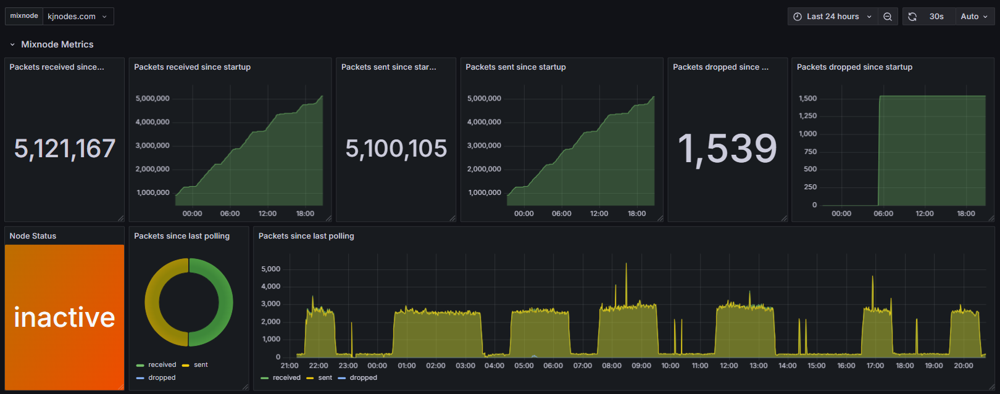
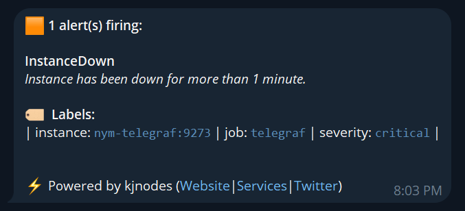

<p align="center">
  
</p>

# Nym Mixnode Monitoring stack

This project provides a monitoring solution for Nym Mixnode using Telegraf, Prometheus, Grafana, and Alertmanager. The stack enables real-time data visualization, monitoring, and alerting for your node's health and performance.

## Installation

Follow these steps to install the necessary dependencies and deploy the monitoring stack.

### 1. Install Docker

Install Docker, a containerization platform required for running the monitoring services:

```bash
sudo apt-get update
sudo apt-get -y install ca-certificates curl

sudo install -m 0755 -d /etc/apt/keyrings
sudo curl -fsSL https://download.docker.com/linux/ubuntu/gpg -o /etc/apt/keyrings/docker.asc
sudo chmod a+r /etc/apt/keyrings/docker.asc

echo "deb [arch=$(dpkg --print-architecture) signed-by=/etc/apt/keyrings/docker.asc] https://download.docker.com/linux/ubuntu $(. /etc/os-release && echo "$VERSION_CODENAME") stable" | sudo tee /etc/apt/sources.list.d/docker.list > /dev/null
sudo apt-get update

sudo apt-get -y install docker-ce docker-ce-cli containerd.io docker-buildx-plugin docker-compose-plugin

sudo systemctl enable docker.service containerd.service
sudo systemctl start docker.service containerd.service
```

### 2. Clone the Monitoring Stack Repository

Clone the repository that contains the monitoring stack configuration:

```bash
rm -rf $HOME/nym-mixnode-monitoring
git clone https://github.com/kjnodes/nym-mixnode-monitoring.git $HOME/nym-mixnode-monitoring
cd $HOME/nym-mixnode-monitoring
```

## Pre-Configuration

Before deploying the monitoring stack, configure Alerting and Prometheus settings.

### 1. Set Up Telegram Alerting

Configure Alertmanager to send notifications via Telegram. Update the `YOUR_TELEGRAM_BOT_TOKEN` and `YOUR_TELEGRAM_USER_ID` in the Alertmanager configuration file.

| KEY | VALUE |
|---------------|-------------|
| YOUR_TELEGRAM_USER_ID | Your Telegram user ID can be obtained from [@userinfobot](https://t.me/userinfobot). |
| YOUR_TELEGRAM_BOT_TOKEN | Get your bot token from [@botfather](https://telegram.me/botfather). Follow the steps outlined [here](https://core.telegram.org/bots#6-botfather) to create a new token. |

Edit the configuration file:

```bash
vim alertmanager/alertmanager.yml
```

Example configuration:

```yml
global:
  resolve_timeout: 1m

templates: 
- 'templates/*.tmpl'

route:
  receiver: 'telegram'
  group_by: []            # Empty list to avoid grouping alerts
  group_wait: 0s          # Send notifications immediately
  group_interval: 1s      # Set a minimal interval for ongoing alerts
  repeat_interval: 4h     # Repeat notifications for ongoing alerts every 4 hours

receivers:
  - name: 'telegram'
    telegram_configs:
      - send_resolved: true
        bot_token: '74064354354:AfeDFge7zdw-oJBOyf1CuEryo9gwpFfcw'
        chat_id: 442175262
        message: '{{ template "telegram.message" . }}'
```

### 2. Configure Telegraf variables

Copy example `.env` file

```bash
cp telegraf/telegraf.env.example telegraf/telegraf.env
```

Open the `telegraf/telegraf.env` file in a text editor and fill in the required mixnode details. You can find these details in your mixnode profile on the [Mixnet Explorer by Nodes.Guru](https://mixnet.explorers.guru/mixnodes)

- Locate and open your mixnode profile.
- Copy the necessary information from your mixnode profile and paste it into `telegraf.env`.

Edit the environment file:

```bash
vim telegraf/telegraf.env
```

Example configuration:

```yml
MIXNODE_NAME="kjnodes.com"
MIXNODE_PUBLIC_IP="185.8.60.223"
MIXNODE_PORT="8080"
MIXNODE_MIX_ID="1695"
MIXNODE_IDENTITY_KEY="3xTEDKuHoc5Q8NSgW9aR2EWcGGhdbh4hfjxkrQugKwKP"
MIXNODE_WALLET_ADDRESS="n1nlnrqdwkcpcsks4yjhzz6t4smpxnqj8m47t8n9"
```

## Monitoring stack deployment

```bash
cd $HOME/nym-mixnode-monitoring
docker compose up -d
```

## Data Visualization Using Grafana

Follow these steps to access and use the Nym Mixnode Dashboard in Grafana:

1. Open Grafana in your web browser (default port: 9999).

2. Log in using the default credentials `admin/admin`, then set a new password.

3. Navigate to the `Dashboards` page to access the `Nym Mixnode Dashboard`.

## Dashboard contents

The Grafana dashboard is organized into three main sections:

### 1. System

Shows system related metrics like build info, node sync status and service uptime.



### 2. Network

Displays peer connections.


### 3. Blockchain

Displays blockchain metrics, including block time, store put metrics, shrex responses and headers metrics.


## Alerting and Notifications

Alertmanager triggers alerts and sends notifications via Telegram when configured conditions are met, such as degraded block synchronization or low peers.

### Alerting Rules (Conditions)

1. Alert if node is not in sync.
2. The number of connected peers is low.
3. Block production is stalled.
4. No metrics received.

Example of Telegram notification:

<div style="text-align: center;">
    
</div>

## Clean Up All Container Data

> **Warning:** This will remove all container monitoring stack data.

To stop and remove the monitoring stack and associated data, execute:

```
cd $HOME/nym-mixnode-monitoring
docker compose down --volumes
```

## Accessing the Monitoring Stack UI

You can access the monitoring tools using these ports:
- Telegraf: 9273
- Prometheus: 9090
- Alertmanager: 9093
- Grafana: 9999
